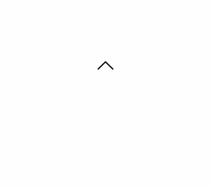
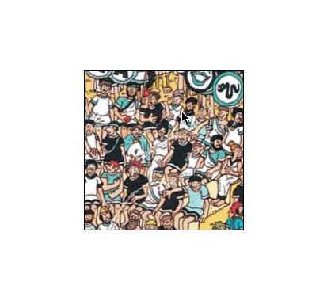

I thought it would be fun to play around with custom cursors and scrolling in Javascript by using it to navigate around a picture.

The first part that I thought to tackle would be adding custom cursors. These cursors should indicate the direction that you are scrolling in. I achieved this using CSS classes and JS `mousemove` events.

Specifying a cursor requires a path to an image or icon
```css
.left {
  cursor: url('./assets/caret-left.png'), auto;
}
```
Some browsers don't support image sizes above 32 x 32px, despite the specifications allowing up to 128 x 128px. Additionally, it is important to specify a fallback cursor option, which in our case is the `auto` value following the cursor asset url, for the browser to recognise it as valid CSS.

Javascript
```javascript
const bodyHeight = document.body.offsetHeight;
const bodyWidth = document.body.offsetWidth;

function applyCaret(e) {
  var heightOffset = bodyHeight/2 - e.clientY;
  var widthOffset = bodyWidth/2 - e.clientX;
  document.body.className = '';

  /*
    Some logic goes here to calculate which quadrant
    the cursor is in and add the relevant class
  */
}

window.addEventListener('mousemove', applyCaret);
```



You can view the code for changing the cursor by screen position on [Github](https://github.com/RupertSaxton/cursor-fun/commit/24d3622d4b28e2dc4057006ffed04b7ca7dd7b31).


The second part to this is to add scrolling behaviour. I embedded an image by creating a container of fixed dimensions and setting `overflow: scroll` in the CSS. I disabled the cursor behaviour when moving over the image container and scrolled to (roughly) the center with the following:
```javascript
// Will stop event propagation that would trigger cursor caret determination
function removeCaret(e) {
  e.stopPropagation();
  body.className = '';
}

imageContainer.addEventListener('mousemove', removeCaret);
// Scrolls roughly to the center
imageContainer.scroll(image.naturalWidth/2, image.naturalHeight/2);
```
I then updated the scroll position using:
```javascript
// Scroll left by 10px
imageContainer.scroll(container.scrollLeft - 10, container.scrollTop)
```


There's still lots more I could improve on this but it was an entertaining way of developing some familiarity with JS scrolling and applying custom styles.

You can view the full code here on [Github](https://github.com/RupertSaxton/cursor-fun/)
